<div align="center">

# DeepVision Studio

### 面向深度学习教学的交互式可视化实验平台

把抽象的网络结构、张量流动、训练过程与梯度传播，变成可以操作、观察和解释的实验。

### [🌐 在线体验：1.117.223.242](http://1.117.223.242/)

[](https://github.com/hewanglanhao/deepvision-studio/stargazers)
[](https://github.com/hewanglanhao/deepvision-studio/forks)


[快速开始](#快速开始) · [功能介绍](#功能介绍) · [项目架构](#项目架构) · [开发文档](docs/development-document.md) · [参与贡献](#参与贡献)

</div>

## 项目简介

DeepVision Studio 是一个面向课程教学、自主学习和课堂演示的深度学习可视化平台。项目提供 A–H 八种学习模式，覆盖前向传播、真实模型训练、CNN 与 Transformer 可解释性、反向传播、RNN/BPTT、个性化练习与学习分析。

它不只播放预制动画：A 模式由 NumPy 服务执行网络计算，B 模式通过 PyTorch 完成真实训练与 checkpoint 推理，C/D 模式在浏览器中运行 CNN/GPT-2 模型，E/F 模式用可交互的计算引擎逐步呈现算法细节，G/H 模式则根据真实作答记录形成个性化练习与学习反馈闭环。

## 项目演示

<p align="center">
  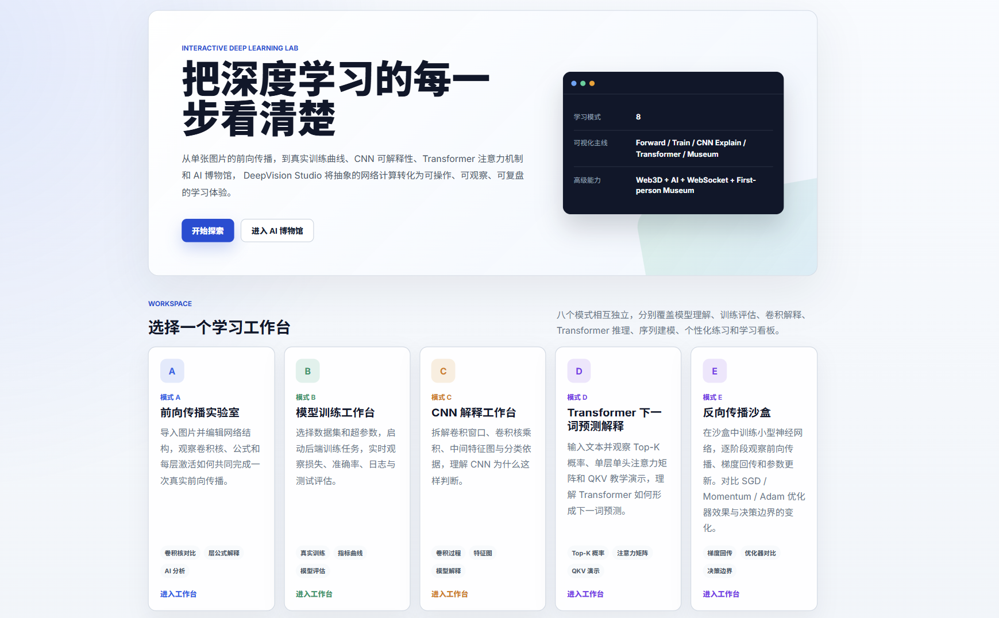
</p>
<p align="center"><sub>DeepVision Studio 首页与八种学习模式入口</sub></p>

## 功能介绍

### 八种学习模式

| 模式 | 实验主题 | 主要能力 |
| --- | --- | --- |
| **A · 前向传播实验室** | CNN 风格网络与逐层计算 | 编辑网络结构、选择输入样本、执行真实前向传播、查看逐层张量与 Top-K 结果、保存实验快照、3D 网络展示 |
| **B · 模型训练工作台** | 端到端 PyTorch 训练 | 数据集管理、网络与超参数配置、实时指标和日志、反向传播观察、暂停/继续训练、checkpoint、实验对比与单样本推理 |
| **C · CNN 卷积解释器** | 卷积网络内部机制 | 网络拓扑、中间特征图、卷积/ReLU/Pooling/Softmax 逐步解释、Grad-CAM 热力图与解释报告 |
| **D · Transformer 解释器** | GPT-2 下一词预测 | 浏览器端 ONNX 推理、Top-K 概率、层与注意力头选择、Attention Matrix、Q/K/V 计算链和解释报告 |
| **E · 反向传播沙盒** | MLP 与梯度下降 | 前向计算、损失、链式法则、梯度回传、参数更新、决策边界、权重热力图与优化器对比 |
| **F · RNN / BPTT 实验室** | 循环网络与序列学习 | RNN 时间展开、隐藏状态、权重矩阵、序列分类、BPTT 梯度传播和训练过程可视化 |
| **G · 个性化出题作题** | 学习画像驱动的自适应练习 | 薄弱知识点补强、间隔复习、套题组卷、难度推荐、作答记录与 AI 解题引导 |
| **H · 学习情况看板** | 学习诊断与复习规划 | 掌握度分析、薄弱知识点、复习状态、正确率统计、错题本和定向重新练习 |

### A 模式 · 看见一次前向传播

自由组合网络层并选择样本，由 Python/NumPy 执行真实计算；前端同步展示每层输出 shape、激活张量、分类结果和网络快照。适合讲解“输入如何一步步变成预测”。

<p align="center">
  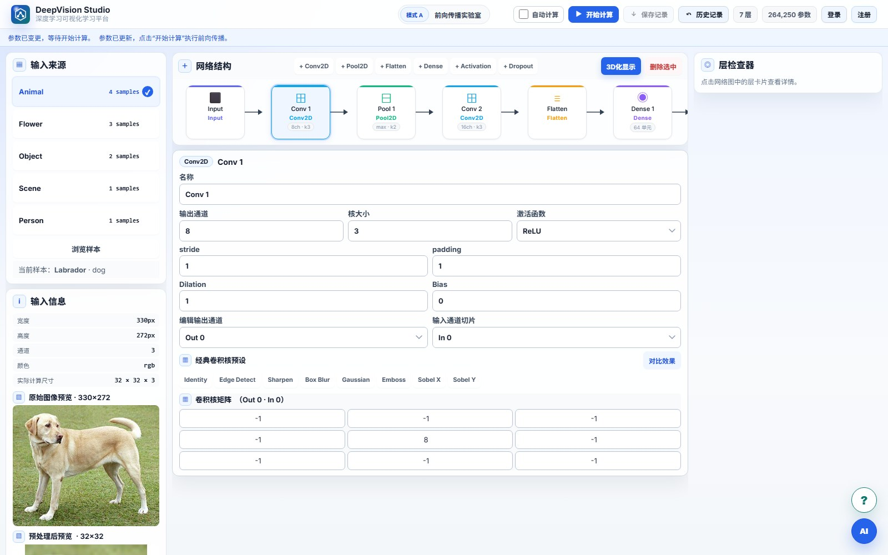
</p>
<p align="center"><sub>网络结构编辑、输入样本与逐层参数检查</sub></p>

### B 模式 · 从数据集到可复用模型

配置数据划分、网络结构和训练参数后，Spring Boot 会启动 PyTorch worker 执行真实训练，并通过 WebSocket 推送 loss、accuracy、学习率、梯度范数和日志。训练结果可保存为 checkpoint，用于实验对比、复测和单样本逐层推理。

<p align="center">
  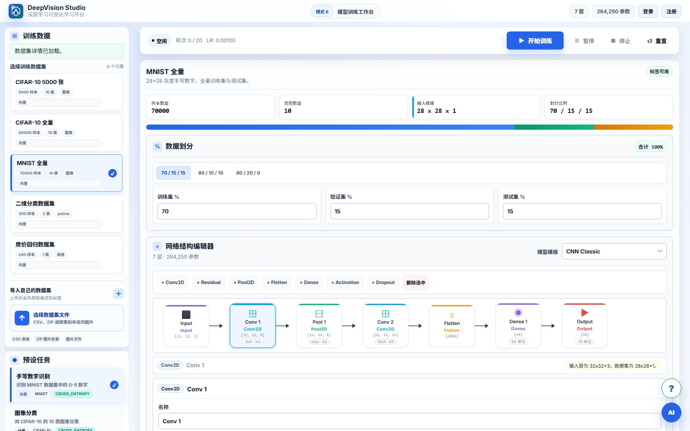
</p>
<p align="center"><sub>数据集管理、训练配置与可视化网络编辑器</sub></p>

### C / D 模式 · 解释 CNN 与 Transformer

C 模式聚焦卷积核、特征图和 Grad-CAM；D 模式围绕 GPT-2 下一词预测，展示注意力矩阵与 QKV 数据流。两种模式都在浏览器中运行推理，更适合课堂投屏和交互演示。

<p align="center">
  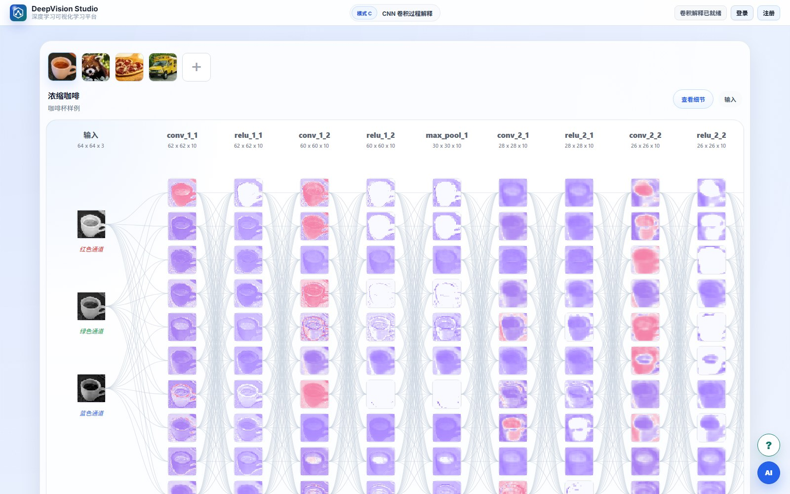
  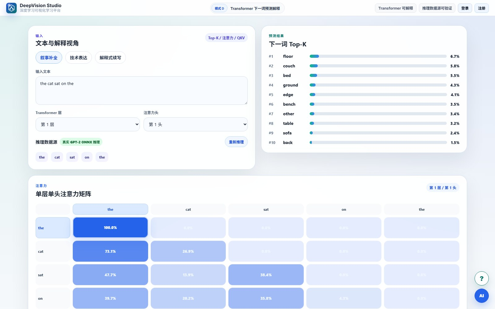
</p>
<p align="center"><sub>CNN 中间特征图与 GPT-2 注意力矩阵</sub></p>

### E / F 模式 · 拆开梯度传播与序列学习

E 模式将一次训练拆成前向、损失、反向和更新四个阶段；F 模式把 RNN 沿时间展开，呈现隐藏状态与 BPTT。两个实验均支持逐步观察，方便把公式和实际数值对应起来。

<p align="center">
  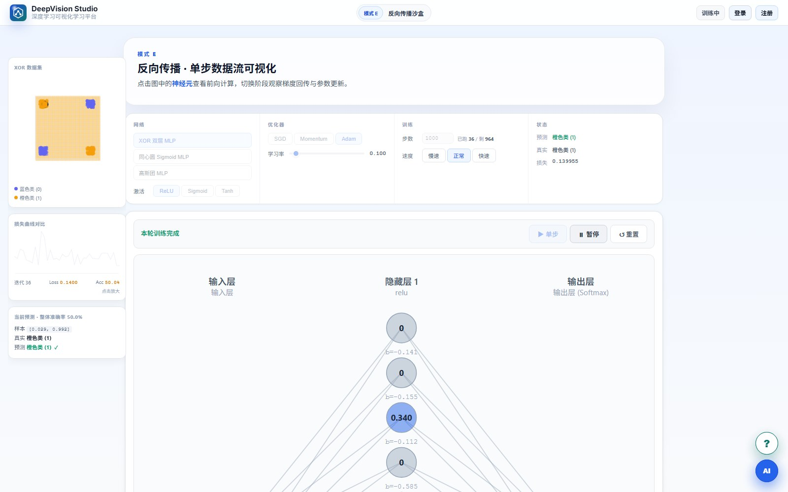
  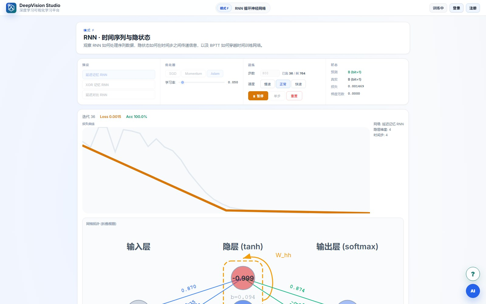
</p>
<p align="center"><sub>运行中的反向传播与 RNN 序列训练</sub></p>

### 多人联机 AI 博物馆 · 沉浸式回顾人工智能发展史

基于 Three.js 构建第一人称人工智能发展史长廊，可使用 WASD 或方向键移动、鼠标控制视角并靠近展墙阅读展品。联机模式通过 WebSocket 同步访客的位置与朝向，让多名学习者以可区分的虚拟形象进入同一展厅共同参观。

<p align="center">
  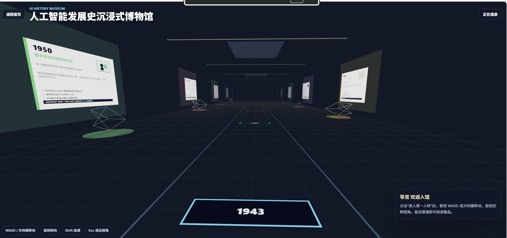
</p>
<p align="center"><sub>第一人称 AI 发展史展厅、时间轴展品与多人在线漫游</sub></p>

### G 模式 · 基于学习画像的个性化练习

系统根据用户的知识点掌握度、近期错题和练习间隔推荐题目，支持优先补弱、间隔复习与套题组卷三种策略。每次作答都会更新个人画像和练习轨迹，并可调用 AI 助手进行苏格拉底式解题引导，而不是直接给出答案。

<p align="center">
  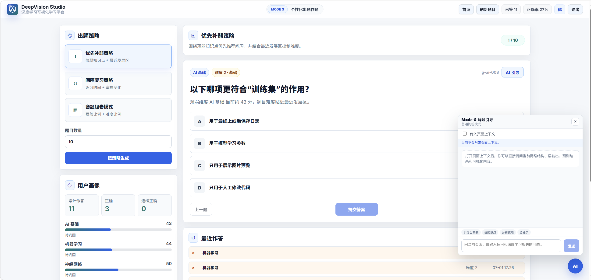
</p>
<p align="center"><sub>出题策略、用户画像、自适应难度与 AI 解题引导</sub></p>

### H 模式 · 学习情况看板与错题本

H 模式读取 G 模式的真实作答记录，集中呈现累计作答、正确率、知识点掌握度和复习状态。系统会标记需要复习或已经到期的知识点，并将仍未订正的题目收入错题本，用户可一键返回 G 模式进行补弱练习或间隔复习。

<p align="center">
  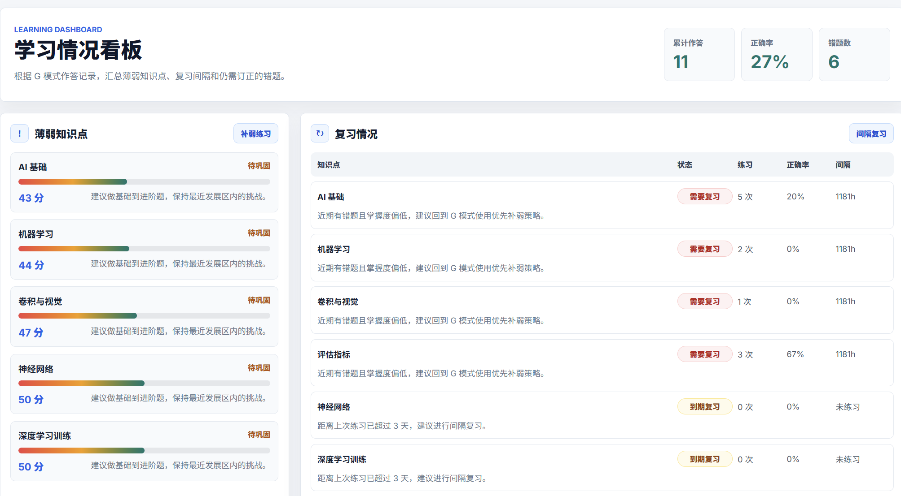
</p>
<p align="center"><sub>薄弱知识点、掌握度与间隔复习状态</sub></p>

<p align="center">
  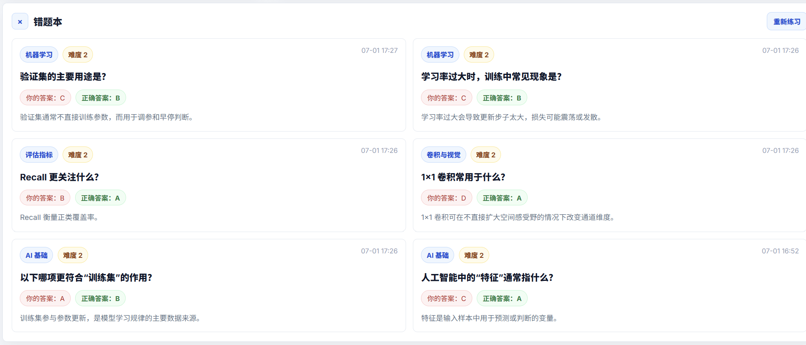
</p>
<p align="center"><sub>保留错误答案、正确答案与知识点解析的错题本</sub></p>

### 平台级能力

- **实验记录与回溯：** 登录后保存 A 模式快照以及 B 模式训练 checkpoint。
- **实验对比与推理：** 对比模型结构、超参数和训练曲线，并使用已训练模型执行单样本推理。
- **训练协作：** 独立协作房间、在线成员、聊天室、训练状态旁观和日志同步。
- **AI 教学助手：** 结合当前实验上下文解释网络结构、训练指标和可视化结果；配置 API Key 后启用。
- **统一教学提示：** 术语解释和帮助浮标覆盖各实验模式。
- **容器化部署：** 使用 Docker Compose 启动前端、Spring 后端和 Python 前向服务。

## 项目架构

```text
Angular 20 前端
├─ A：网络编辑与结果可视化 ── Spring Boot ── Python / NumPy
├─ B：训练工作台与协作 ───── Spring Boot ── PyTorch Worker
├─ C：CNN Explainer ───────── 浏览器端 TensorFlow.js
├─ D：Transformer Explainer ─ 浏览器端 ONNX Runtime Web
├─ E：反向传播沙盒 ────────── TypeScript 计算引擎
├─ F：RNN / BPTT ───────────── TypeScript 计算引擎
├─ G：个性化练习 ───────────── Spring Boot / H2
├─ H：学习情况看板 ─────────── Spring Boot / H2
└─ AI 博物馆 ───────────────── Three.js / WebSocket

Spring Boot
├─ JWT 认证与 H2 数据库
├─ 数据集、训练任务与 checkpoint
├─ REST / WebSocket
└─ LLM 服务代理
```

| 层级 | 技术 |
| --- | --- |
| 前端 | Angular 20、TypeScript、RxJS、Three.js、TensorFlow.js、ONNX Runtime Web |
| 业务后端 | Java 17、Spring Boot 3.3、Spring Security、JPA、WebSocket、H2 |
| 计算服务 | Python、NumPy、PyTorch、Flask |
| 部署 | Docker、Docker Compose、Nginx |

## 快速开始

### 方式一：Docker Compose（推荐）

准备好 Docker Desktop 后，在项目根目录运行：

```bash
git clone https://github.com/hewanglanhao/deepvision-studio.git
cd deepvision-studio
docker compose up --build
```

打开 <http://localhost:4200/> 即可访问平台。

> [!IMPORTANT]
> 首次构建会下载并校验约 **626 MiB** 的 GPT-2 ONNX 资源，因此需要稳定网络并等待一段时间。资源只用于 D 模式的真实推理，详细说明见 [Mode D 资源安装与验证](docs/mode-d-assets.md)。

如需启用 AI 教学助手，可在启动前设置模型服务环境变量：

```powershell
$env:ARK_API_KEY="你的 API Key"
$env:ARK_MODEL="你的模型名称"
docker compose up --build
```

### 方式二：本地开发

需要 Node.js 22、Java 17、Maven 3.9 和 Python 3.10+。

启动前端：

```powershell
cd frontend
npm ci
npm run setup:mode-d   # 需要 D 模式真实推理时执行，可跳过
npm start
```

启动 Python 前向服务：

```powershell
cd backend/python-forward
python -m venv .venv
.\.venv\Scripts\Activate.ps1
pip install -r requirements.txt
python app.py
```

启动 Spring 后端：

```powershell
cd backend/spring
mvn spring-boot:run
```

默认服务地址：

| 服务 | 地址 |
| --- | --- |
| Web 前端 | <http://localhost:4200/> |
| Spring API | <http://127.0.0.1:8080> |
| Swagger UI | <http://127.0.0.1:8080/swagger-ui/index.html> |
| Python Forward | <http://127.0.0.1:5000> |

> B 模式的 PyTorch worker 由 Spring 按任务自动启动，不是常驻 HTTP 服务。本地体验 B 模式前，请安装 `backend/python-training/requirements.txt`，并通过 `DEEPVISION_TRAINING_PYTHON` 指定可用的 Python 解释器。Docker 环境已自动完成这些配置。

## 项目结构

```text
deepvision-studio/
├─ frontend/                 # Angular 前端、A–H 模式与 AI 博物馆
├─ backend/
│  ├─ spring/               # 认证、训练编排、数据与 WebSocket
│  ├─ python-forward/       # A 模式 NumPy 前向计算服务
│  └─ python-training/      # B 模式 PyTorch 训练 worker
├─ docs/                    # 开发文档与资源说明
├─ course-presentation/     # 项目展示材料
├─ scripts/                 # 项目辅助脚本
└─ docker-compose.yml
```

## 开发与验证

```powershell
# 前端构建
cd frontend
npm run check:mode-d   # 已安装 D 模式资源时执行
npm run build

# Spring 测试
cd ../backend/spring
mvn test
```

更多设计细节、接口说明和模块实现见 [完整开发文档](docs/development-document.md)。

## 参与贡献

欢迎提交 Issue、功能建议和 Pull Request：

1. Fork 本仓库并创建功能分支。
2. 完成修改并执行相关构建或测试。
3. 使用清晰的提交信息说明改动目的。
4. 发起 Pull Request，并附上截图、录屏或验证结果。

可以从这些方向参与：补充教学案例、优化可视化交互、增加测试、完善跨平台启动脚本、改进英文文档或贡献新的网络解释模式。

## 支持项目

如果 DeepVision Studio 对你的学习、教学或项目设计有帮助，欢迎点击右上角 **Star**。你的支持会让更多学习者发现这个项目，也会帮助我们持续完善实验内容与使用体验。

<div align="center">

**让神经网络不再只是公式，而是可以亲手探索的过程。**

</div>
